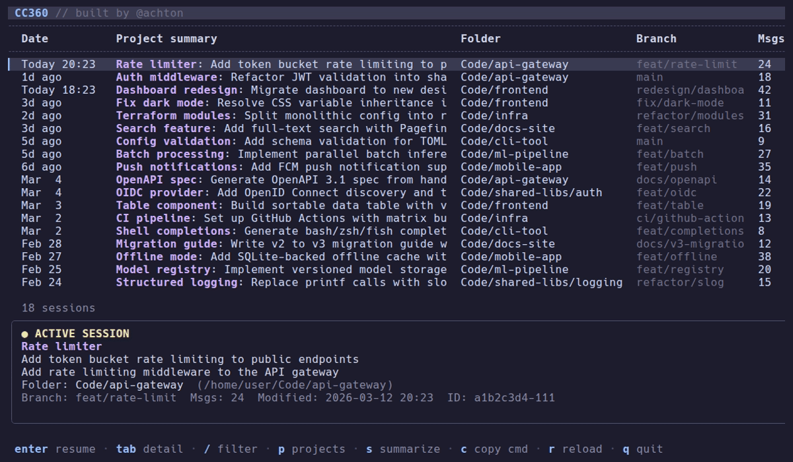

# CC360 — Claude Code 360

A terminal UI for browsing, searching, filtering, and resuming [Claude Code](https://claude.ai/claude-code) sessions across multiple projects.



## Why

After a reboot or across days of work, there's no easy way to see what Claude Code sessions existed, what they were about, or to resume them. Claude Code's `--resume` flag requires knowing the session ID. CC360 gives you a persistent, searchable overview of all sessions across your project directories.

## Install

Requires [Claude Code](https://docs.anthropic.com/en/docs/claude-code) installed.

### Download binary

Download the latest release for your platform from [GitHub Releases](https://github.com/achton/cc360/releases/latest), extract, and place in your `$PATH`:

```bash
tar xzf cc360_*.tar.gz
sudo mv cc360 /usr/local/bin/
```

Binaries are available for Linux and macOS (amd64 and arm64).

### From source

Requires Go 1.25+.

```bash
go install github.com/achton/cc360@latest
```

## First run

On first launch, CC360 creates a config file at `~/.config/cc360/config.toml` and exits with setup instructions. Edit the config to add your project directories:

```toml
scan_paths = ["~/Code", "~/Code-private"]
```

Then run `cc360` again to launch the TUI.

## Configuration

Config file: `~/.config/cc360/config.toml`

| Setting | Default | Description |
|---------|---------|-------------|
| `scan_paths` | `[]` | Directories containing your projects. CC360 scans `~/.claude/projects/` for sessions matching these paths. **Required.** |
| `scan_orphans` | `true` | Include sessions found in `.jsonl` files that aren't listed in any session index. |
| `hide_sidechains` | `true` | Hide sidechain (branched conversation) sessions. |
| `sort_by` | `"modified"` | Default sort order. Options: `modified`, `created`, `messages`, `project`. |
| `auto_summarize` | `25` | Number of unsummarized sessions to auto-summarize on launch. Set to `0` to disable. |
| `summarize_concurrency` | `3` | Max concurrent summarization calls. |
| `summarize_model` | `"sonnet"` | Model for AI summarization via `claude --print`. |

## Keybindings

| Key | Action |
|-----|--------|
| `↑`/`k`, `↓`/`j` | Navigate up/down |
| `PgUp`, `PgDn` | Page up/down |
| `Home`/`g`, `End`/`G` | Jump to top/bottom |
| `Enter` | Resume the selected session (`claude --resume`) |
| `Tab` | Toggle detail pane (open by default) |
| `/` | Open text filter (live search across all fields) |
| `p` | Open project picker (tree view with multi-select) |
| `s` | Summarize selected session |
| `c` | Copy resume command to clipboard (via OSC 52) |
| `r` | Reload config and re-scan all sessions |
| `Esc` | Clear text filter |
| `q`, `Ctrl+C` | Quit |

### Filtering

Press `/` to open the text filter. Type to search across project names, titles, summaries, first prompts, and git branches. Press `Enter` to stop typing and navigate the filtered results — the filter stays visible. Press `/` again to edit the filter text. Press `Esc` to clear.

Press `p` to open the project picker, which shows a collapsible tree of projects grouped by directory. Use `Space` to toggle selection, `←`/`→` to collapse/expand groups, and `Enter` to apply. Multiple projects can be selected at once. Sessions in root directories (not subfolders) appear as a dimmed `(root)` entry.

Filters stack: pick projects with `p`, then refine with `/`.

## Active session detection

CC360 detects currently running Claude Code sessions by scanning `/proc/*/cmdline` for claude processes. Active sessions are marked with a green `●` next to the date and cannot be resumed (to prevent conflicts). Detection refreshes every 15 seconds.

## AI summarization

CC360 can generate short titles and summaries for sessions by calling `claude --print`. On launch, it auto-summarizes the newest unsummarized sessions (configurable via `auto_summarize`). Press `s` to manually summarize the selected session. Sessions that haven't been modified since their last summarization are skipped.

Summaries are stored in the SQLite cache and persist across runs.

## How it works

### Data sources

CC360 reads Claude Code's own data files:

- **Session index**: `~/.claude/projects/{encoded-path}/sessions-index.json` contains metadata for each session (ID, timestamps, branch, message count, summary).
- **Orphan JSONL files**: Some sessions exist only as `.jsonl` transcript files without an index entry. CC360 parses the first 15 lines to extract metadata (cwd, branch, first prompt), then scans the full file for the last timestamp and message count.

The encoded path replaces `/` with `-` (e.g. `/home/user/Code/myproject` → `-home-user-Code-myproject`).

### Caching

Session metadata is cached in a SQLite database at `~/.cache/cc360/cc360.db`. On each launch, CC360 scans the disk and upserts into the cache. The cache preserves AI-generated titles and summaries across runs.

### Session filtering

CC360 automatically filters out non-interactive sessions:

- **Hook/command sessions** — Sessions containing "Caveat: The messages below were generated by the user while running local commands." These are created by Claude Code's hook system and contain automated output, not interactive conversations.
- **Sub-agent sessions** — Sessions starting with `<teammate-message>`. These are spawned as background workers and aren't meaningful to resume independently.

### Display

The "Project summary" column shows (in priority order):

1. AI-generated title + summary (combined with " — ")
2. Claude's own session summary from the index file
3. The first user message as a fallback

The "Folder" column shows the project directory relative to the scan path (e.g. `Code/myproject`, `Code/lib/mylib`). Worktree sessions show a `⌥` indicator next to the folder name.

Columns are responsive: Branch appears at 90+ columns, message count at 100+.

## Project structure

```
main.go                         Entry point
internal/
  config/config.go              TOML config loading, first-run experience
  scanner/
    scanner.go                  Dual-source session discovery (index + orphan JSONL)
    active.go                   Active session detection via /proc
  db/db.go                      SQLite cache (pure Go, no CGo)
  summarizer/summarizer.go      AI summarization via claude --print
  tui/
    model.go                    Bubbletea model, update loop, actions
    table.go                    Custom table rendering (columns, rows, scrolling)
    detail.go                   Togglable detail pane
    filter.go                   Text filter input
    picker.go                   Project picker overlay
    keys.go                     Key bindings
    styles.go                   Lipgloss styles
```

## Tech stack

- [Go](https://go.dev) 1.25+
- [Bubbletea](https://github.com/charmbracelet/bubbletea) — Elm-architecture TUI framework
- [Lipgloss](https://github.com/charmbracelet/lipgloss) — Terminal styling
- [Bubbles](https://github.com/charmbracelet/bubbles) — Spinner, text input components
- [modernc.org/sqlite](https://pkg.go.dev/modernc.org/sqlite) — Pure Go SQLite (no CGo)
- [BurntSushi/toml](https://github.com/BurntSushi/toml) — Config parsing

## License

MIT
