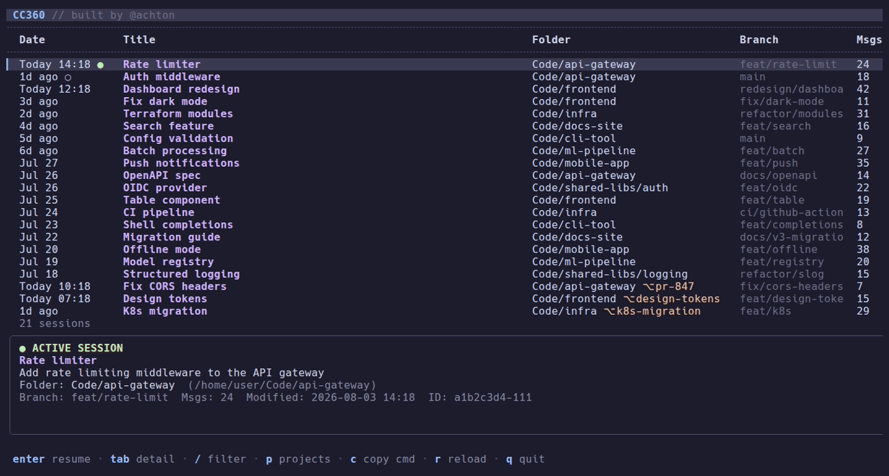

# cc360 - Claude Code 360

[](https://github.com/achton/cc360/actions/workflows/ci.yml)
[](https://github.com/achton/cc360/releases/latest)
[](https://goreportcard.com/report/github.com/achton/cc360)
[](LICENSE)

A terminal UI for browsing, searching, filtering, and resuming [Claude Code](https://claude.ai/claude-code) sessions across multiple projects.



## Why

After a reboot or across days of work, there's no easy way to see what Claude Code sessions existed, what they were about, or to resume them. Claude Code's `--resume` flag requires knowing the session ID. `cc360` gives you a persistent, searchable overview of all sessions across your project directories.

## Install

Requires [Claude Code](https://docs.anthropic.com/en/docs/claude-code) installed.

### Homebrew (macOS)

```bash
brew install --cask achton/tap/cc360
```

Linux users: use the install script or a distro package below. Homebrew casks are
macOS-only.

Upgrading from a pre-v0.5.1 formula install: `brew uninstall cc360` first.

### Install script (macOS / Linux)

```bash
curl -fsSL https://raw.githubusercontent.com/achton/cc360/main/install.sh | sh
```

Installs the latest release to `/usr/local/bin` (override with `CC360_INSTALL_DIR`). Pin a version by passing it as an argument, e.g. `... | sh -s -- v0.3.0`.

### Linux packages (.deb / .rpm / .apk)

Download the package for your distro from [GitHub Releases](https://github.com/achton/cc360/releases/latest) and install it:

```bash
sudo dpkg -i cc360_*_linux_amd64.deb     # Debian / Ubuntu
sudo rpm -i cc360_*_linux_amd64.rpm       # Fedora / RHEL / openSUSE
sudo apk add --allow-untrusted cc360_*_linux_amd64.apk  # Alpine
```

### Go

```bash
go install github.com/achton/cc360@latest
```

### Binary

Download the latest release for your platform from [GitHub Releases](https://github.com/achton/cc360/releases/latest). Binaries are available for Linux and macOS (amd64 and arm64).

## First run

On first launch, `cc360` creates a config file at `~/.config/cc360/config.toml` and exits with setup instructions. Edit the config to add your project directories:

```toml
scan_paths = ["~/Code", "~/Projects"]
```

Then run `cc360` again to launch the TUI.

## Configuration

Config file: `~/.config/cc360/config.toml`

| Setting | Default | Description |
|---------|---------|-------------|
| `scan_paths` | `[]` | Directories containing your projects. `cc360` scans `~/.claude/projects/` for sessions matching these paths. **Required.** |
| `scan_orphans` | `true` | Include sessions found in `.jsonl` files that aren't listed in any session index. |
| `hide_sidechains` | `true` | Hide sidechain (branched conversation) sessions. |
| `sort_by` | `"modified"` | Default sort order. Options: `modified`, `created`, `messages`, `project`. |
| `show_active` | `true` | Mark sessions that are currently running. See [Active session detection](#active-session-detection). |

## Keybindings

| Key | Action |
|-----|--------|
| `↑`/`k`, `↓`/`j` | Navigate up/down |
| `PgUp`, `PgDn` | Page up/down |
| `Home`/`g`, `End`/`G` | Jump to top/bottom |
| `Enter` | Resume the selected session (`claude --resume`) |
| `Tab` | Toggle detail pane (open by default) |
| `/` | Open text filter (live search across all fields) |
| `p` | Open project picker (tree view with multi-select) |
| `c` | Copy resume command to clipboard (via OSC 52) |
| `r` | Reload config and re-scan all sessions |
| `Esc` | Clear text filter |
| `q`, `Ctrl+C` | Quit |

### Filtering

Press `/` to open the text filter, which searches project names, titles, first prompts, git branches, and summaries. `Enter` keeps the filter and moves to the results, `/` edits it again, `Esc` clears it.

Press `p` to open the project picker, a collapsible tree grouped by directory. `Space` toggles selection, `←`/`→` collapse and expand groups, `Enter` applies. Sessions in a root directory rather than a subfolder appear as a dimmed `(root)` entry.

Filters stack: pick projects with `p`, then refine with `/`.

## Active session detection

`cc360` asks Claude Code which sessions are running, via `claude agents --json`, and marks them next to the date:

- Green `●`: Claude is working
- Grey `○`: running, waiting for input

Running sessions cannot be resumed, to prevent two processes writing one transcript. Detection refreshes every 15 seconds; set `show_active = false` in the config to turn it off.

## How it works

### Data sources

`cc360` reads Claude Code's own data files:

- **JSONL transcripts**: `~/.claude/projects/{encoded-path}/{session-id}.jsonl`. `cc360` parses the first 15 lines for metadata (cwd, branch, first prompt), then scans the full file for the last timestamp, message count, and the AI-generated session title. This is where all current sessions come from.
- **Session index**: `~/.claude/projects/{encoded-path}/sessions-index.json`. Claude Code stopped maintaining this in February 2026; `cc360` still reads it so older sessions keep their metadata.

The encoded path replaces `/` with `-` (e.g. `/home/user/Code/myproject` → `-home-user-Code-myproject`).

### Caching

Session metadata is cached in a SQLite database at `~/.cache/cc360/cc360.db`. On each launch, `cc360` scans the disk and upserts into the cache.

Claude Code deletes transcripts after 30 days. Sessions that have a title stay in the cache so the title survives, until their project falls outside the scan paths.

### Session filtering

`cc360` automatically filters out non-interactive sessions:

- **Hook/command sessions**: automated hook output, identified by the "Caveat: The messages below were generated by the user while running local commands." preamble.
- **Sub-agent sessions**: background workers, identified by a leading `<teammate-message>`. Not meaningful to resume on their own.

### Display

The "Title" column shows (in priority order), matching what Claude Code's own `/resume` picker displays:

1. The AI-generated session title, written by Claude Code itself when a session starts
2. Claude's session summary from the index file, for sessions predating February 2026
3. The first user message
4. The project name

The "Folder" column shows the project directory relative to the scan path (e.g. `Code/myproject`, `Code/lib/mylib`). Worktree sessions show a `⌥` indicator next to the folder name.

Columns are responsive: Branch appears at 90+ columns, message count at 100+.

## Project structure

```
main.go                         Entry point
internal/
  config/config.go              TOML config loading, first-run experience
  scanner/
    scanner.go                  Dual-source session discovery (index + orphan JSONL)
    active.go                   Active session detection via claude agents --json
  db/db.go                      SQLite cache (pure Go, no CGo)
  tui/
    model.go                    Bubbletea model, update loop, actions
    table.go                    Custom table rendering (columns, rows, scrolling)
    detail.go                   Togglable detail pane
    filter.go                   Text filter input
    picker.go                   Project picker overlay
    keys.go                     Key bindings
    styles.go                   Lipgloss styles
```

## Tech stack

- [Go](https://go.dev) 1.26+
- [Bubbletea](https://github.com/charmbracelet/bubbletea): Elm-architecture TUI framework
- [Lipgloss](https://github.com/charmbracelet/lipgloss): terminal styling
- [Bubbles](https://github.com/charmbracelet/bubbles): spinner and text input components
- [modernc.org/sqlite](https://pkg.go.dev/modernc.org/sqlite): pure Go SQLite, no CGo
- [BurntSushi/toml](https://github.com/BurntSushi/toml): config parsing

## License

MIT
